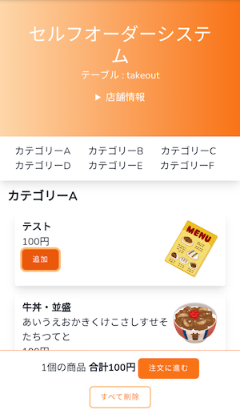

# Self Ordering System

[](https://packagist.org/packages/revolution/self-ordering)


[](https://codeclimate.com/github/kawax/self-ordering/maintainability)
[](https://codeclimate.com/github/kawax/self-ordering/test_coverage)

オープンソースのセルフオーダーシステム



## 目的
スマホで注文するセルフオーダーの普及。

## 定義
- **セルフオーダー**：飲食店などの店内で、自分のスマホで注文。スマホアプリのインストールは不要。
- モバイルオーダー：スマホアプリをインストールして注文。

ここで定義してるセルフオーダーをテーブルオーダーと呼ぶこともあるし、店舗側で用意しているタブレットでの注文をセルフオーダーと呼ぶこともある。  
言葉の定義は世の中的にもまだ固まってないけどここで提供するのはWebシステム一つで実現できるセルフオーダー。  
スマホのカメラでQRコードを読み込んで、スマホのブラウザで注文システムを表示。アプリのインストールや会員登録は不要。

## 概要
- 1店舗1システムで動かす。
- 店舗ごとにカスタマイズして使う前提。
- 商用利用可能。開発・設置・運用代行をビジネスにして良い。
- デフォルトでは決済やPOS連携機能は含めない。拡張はできるので必要なら個別に対応。
- Vercelで動かしやすいようにデータベースなしでの運用も可能にする。
- バージョンアップしやすいようにLaravel用のcomposerパッケージとして作る。Laravelアプリとしては作らない。ほとんどの機能はパッケージ内に含めるのでLaravel側での開発作業は少なめ。

## デモ
- https://self-ordering-starter.vercel.app/order
- https://self-ordering-sample.vercel.app/order

## サポート
### 事業化したい企業や個人事業主向け
「サポートと支払い管理用サイト」も提供できますので飲食店への営業さえできればすぐに事業化可能です。メールかフォームから問い合わせてください。 https://invokable.github.io/

- テキストメッセージでのサポート
- Stripeを使った定期支払い。Stripeのアカウントさえ準備できれば個人事業主でも可。

### 開発者向けのサポート
- GitHubのDiscussions https://github.com/kawax/self-ordering/discussions

### セルフオーダーを導入したい飲食店向け
基本的には導入できる事業者を探してください。直接依頼したい場合はメールかフォームから問い合わせてください。 https://invokable.github.io/

## 動作環境
- PHP ^7.4
- Laravel 8.x
- Livewire 2.x
- Tailwind 2.x

## バージョン
| ver | PHP | Laravel |
|-----|-----|---------|
| 1.x | ^7.4/^8.0 | 8.x |

## インストール
「Laravelでセルフオーダーシステムを作るためのスターターキット」なので必ずLaravelの新規プロジェクトを作るところから始めてください。`ordering:install`コマンドでファイルが上書きされます。

```
curl -s "https://laravel.build/self-ordering-project?with=mysql,redis,mailhog" | bash
cd ./self-ordering-project

composer require revolution/self-ordering

php artisan ordering:install

npm install && npm run dev

./vendor/bin/sail up -d
```

http://localhost/order

簡単に始めるためのプロジェクトテンプレート。  
https://github.com/kawax/self-ordering-starter

### .env
```
ORDERING_MENU_DRIVER=array
ORDERING_ADMIN_PASSWORD=
ORDERING_DESCRIPTION=""

ORDERING_MICROCMS_API_KEY=
ORDERING_MICROCMS_ENDPOINT=https://
```

### routes/web.php
`/`のルートはQRコード表示に使う。

```php
//Route::get('/', function () {
//    return view('welcome');
//});

Route::view('/', 'ordering::help');
```

インストール後にページを増やすのは自由。

## クイックスタート
上記の手順でインストール後に必要なことは「メニューデータの管理方法」と「注文情報の送信先」
を決める。

### ここでの前提
- 決済機能は使わない。
- セルフオーダーは口頭での注文取りの代わり。

### メニューデータの管理方法
店舗側でメニューを変更するなら [microCMS](https://microcms.io/) が一番簡単だろうからmicroCMSにアカウントを作って進める。

### 注文情報の送信先
メールやLINE Notifyなど「注文された時にすぐに気付ける方法」を選ぶ。

### 店舗側での作業
- 店内のテーブルすべてに番号を振る。
- QRコードをテーブルに掲示。
- 「セルフオーダーの使い方」を掲示。こちらで用意したいけどまだない。
- セルフオーダーから注文が入った時のオペレーションを確認。

## 仕様
### ページ
- ユーザー向けの注文ページ
  - QRコードを読み込んで表示。テーブル番号を入力。
  - メニューを選択→注文確認画面→決済を使うなら支払い→注文を送信→注文履歴画面。
- 店舗向けのダッシュボード
  - デフォルトでは簡易的なパスワード認証。

### メニューデータ
- array（デフォルト）
- microCMS
- Googleスプレッドシート
- Contentful
- データベース
- POS

### 注文送信先
基本的にはLaravelの通知機能を使う。

- メール
- LINE Notify
- POS

### 決済
- レジで後払い
- PayPay

## CONTRIBUTING

### コーディング規約
- PSR-12への過渡期なのでLaravel(PSR-2ベース)とPSR-12の混在。
- StyleCI(laravelプリセット)とPhpStorm(Laravelプリセット改)の自動フォーマットに合わせる。

### このパッケージのローカルでの開発方法

レポジトリ2つをローカルにgit clone
- https://github.com/kawax/self-ordering
- https://github.com/kawax/self-ordering-starter

```
git clone https://github.com/kawax/self-ordering
git clone https://github.com/kawax/self-ordering-starter self-ordering-develop
cd ./self-ordering-develop
```

starter側のcomposer.jsonでローカルのパッケージを使うように指定。

```json
    "repositories": [
        {
            "type": "path",
            "url": "../self-ordering"
        }
    ],
```
```json
    "require": {
        "revolution/self-ordering": "*"
    },
```

Sailを使うならdocker-compose.ymlのvolumesも変更。
```yaml
        volumes:
            - '.:/var/www/html'
            - '../self-ordering:/var/www/self-ordering'
```

```
composer install

cp .env.example .env
php artisan key:generate

npm i && npm run dev
```

starter側を起動しながらパッケージ側で作業する。
```
./vendor/bin/sail up -d
```

## LICENCE
MIT
