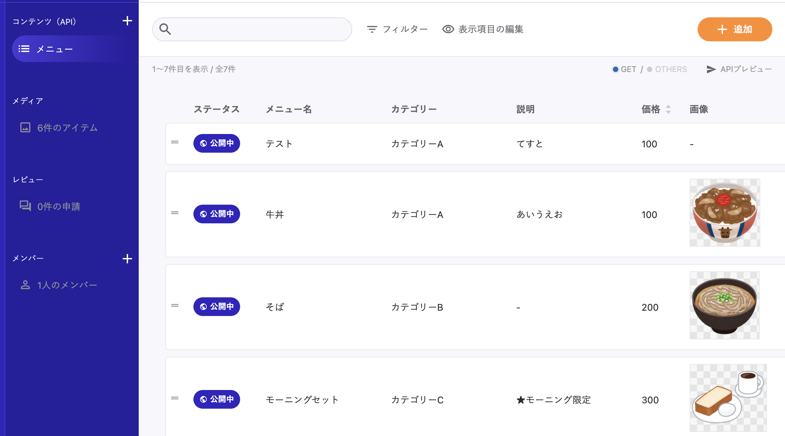

# メニューデータをmicroCMSで管理

https://microcms.io/



## 前提
README通りにインストールしたプロジェクトが前提。

## 手順
- microCMSに登録してサービス作成まで進める。 https://document.microcms.io/manual/getting-started
- APIの作成はAPI名`メニュー`、エンドポイント`menus`で作る。APIの型は「リスト形式」
- APIスキーマは`microcms-api-menus.json`を読み込むこともできる。
- メニューを追加。基本的にはmicroCMSで表示されてる順番＋カテゴリーでまとめられて表示されるのでmicroCMSの管理画面で適切に並べる。「＝」をドラッグで並べ替え可能。

## .env
microCMSから`X-API-KEY`とエンドポイントのURLを確認して.envに設定。
```
ORDERING_MENU_DRIVER=micro-cms
ORDERING_MICROCMS_API_KEY=
ORDERING_MICROCMS_ENDPOINT=https://***.microcms.io/api/v1/menus
```

VercelならEnvironment Variablesで設定。

### メニュー件数
デフォルトではメニューは1000個まで取得。microCMSの制限でデータサイズが大きすぎるとエラーになるので減らしたい場合は.envで設定。

```
ORDERING_MICROCMS_LIMIT=500
```
