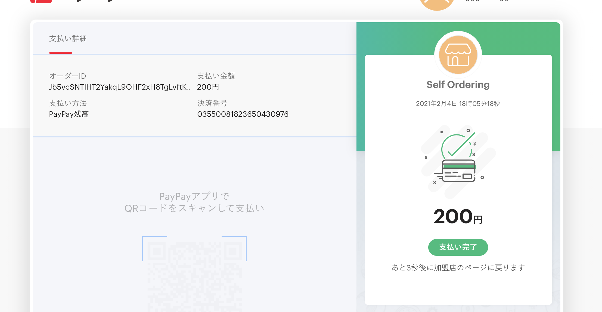

# 決済機能を使う

導入ハードルを下げるため＆お金を扱うのはハイリスクなのでデフォルトでは決済機能は無効です。

## 支払い方法
- レジで後払い。現金など。店頭で通常通り。
- PayPay

PayPayを使うには登録が必要。  
https://developer.paypay.ne.jp/



## 決済機能を有効化
.envで
```
ORDERING_PAYMENT_ENABLED=true

PAYPAY_PRODUCTION=false
PAYPAY_API_KEY=
PAYPAY_API_SECRET=
PAYPAY_MERCHANT_ID=
```

注文確認画面で支払い方法を選べるようになります。

## 利用可能な支払い方法を設定
configファイルを公開してない場合は先に公開。

```
php artisan vendor:publish --tag=ordering-config
```

`config/ordering.php`の使用する支払い方法を変更。注文確認画面でそのまま使われます。

```php
        // 使用する支払い方法
        'methods' => [
            'cash'   => 'レジで後払い',
            'paypay' => 'PayPay',
        ],
```

独自の`PaymentMethod` classを作ってサービスコンテナで入れ替える方法もあります。

`app/Ordering/PaymentMethod.php`
```php
<?php

namespace App\Ordering;

use Illuminate\Support\Collection;

class PaymentMethod
{
    /**
     * @return Collection
     */
    public function methods(): Collection
    {
        return collect([
            'cash'   => 'レジで後払い',
            'paypay' => 'PayPay',
        ]);
    }
}
```

https://github.com/kawax/self-ordering/blob/develop/src/Payment/PaymentMethod.php

`AppServiceProvider@register`で
```php
use App\Ordering\PaymentMethod;
use Illuminate\Support\ServiceProvider;
use Revolution\Ordering\Contracts\Payment\PaymentMethodFactory;

class AppServiceProvider extends ServiceProvider
{
    public function register()
    {
        $this->app->singleton(PaymentMethodFactory::class, PaymentMethod::class);
    }
}
```

## 支払い方法の追加
PaymentManagerを拡張すれば追加可能。  
注文確認画面からリダイレクトした先は支払い方法ごとの担当。  
支払い確認画面のルーティングやviewも独自に作成する。
